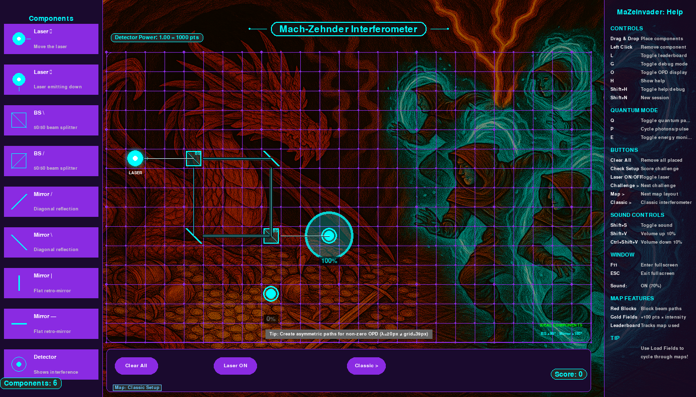
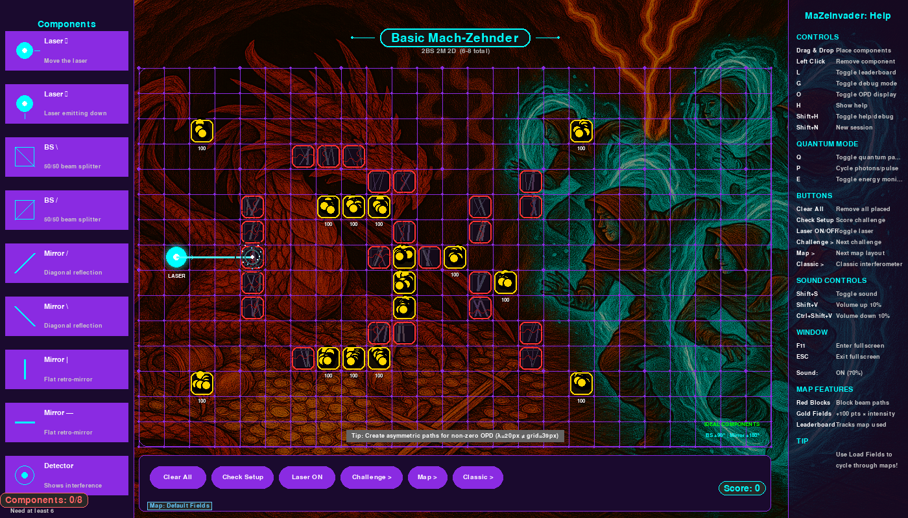
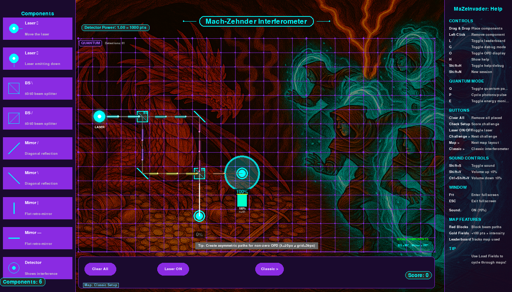
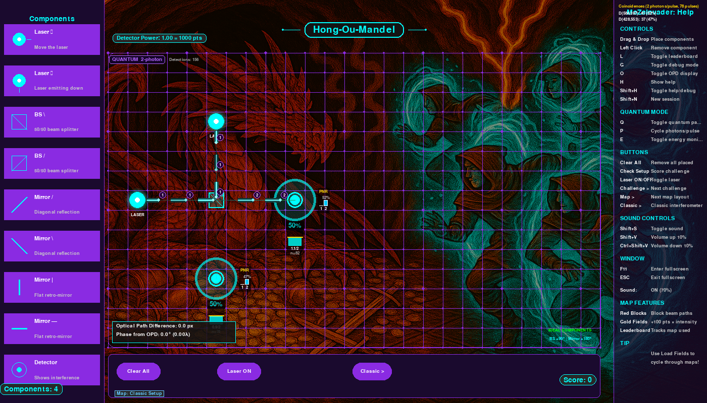
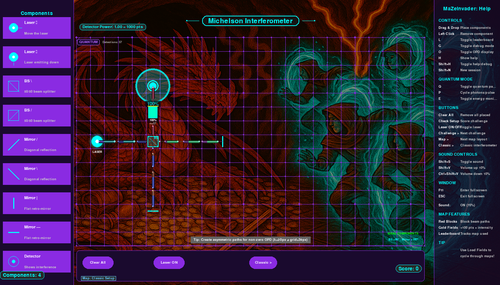

# MaZeInvaders

An interactive quantum optics puzzle game. Build interferometers by placing
beam splitters, mirrors and detectors on a grid, then watch laser beams
interfere in real time. Switch to quantum mode to see single photons split,
propagate and click at detectors — complete with Fock-state multi-photon
simulation and Hong-Ou-Mandel bunching.



## Features

- **Drag-and-drop** optical components onto a grid canvas
- **Real-time wave-optics solver** with proper S-matrix physics — beams
  split, accumulate phase and interfere coherently at detectors
- **Quantum packet mode** — discrete photon wave packets travel the network,
  split at beam splitters and are detected probabilistically (press `Q`)
- **Multi-photon Fock-state simulation** — 1-4 photons per pulse with
  exact quantum correlations (HOM bunching, coincidence counting)
- **Classic interferometer presets** — Mach-Zehnder, Michelson,
  Hong-Ou-Mandel, Rarity-Tapster (press `Classic >`)
- **Challenge mode** with maze-like blocked fields, gold bonus zones and scoring
- **Responsive scaling** — works in windowed and fullscreen mode at any resolution
- **Sound effects** for placement, detection and interference events

## Screenshots

| Challenge mode | Quantum MZI | Hong-Ou-Mandel |
|:-:|:-:|:-:|
|  |  |  |

| Michelson interferometer |
|:-:|
|  |

## Installation

```bash
git clone https://github.com/barkol/mzi.git
cd mzi
pip install -r requirements.txt
```

Requires **Python 3.10+**, **Pygame 2.5+** and **NumPy 1.24+**.

## Running

```bash
python main.py            # windowed (1600x900)
python main.py --fullscreen   # or press F at runtime
```

## How to play

1. **Drag components** from the left sidebar onto the grid
2. The laser fires automatically — beams trace through your setup in
   real time
3. Arrange **beam splitters**, **mirrors** and **detectors** to build a
   working interferometer
4. Press **Q** to enter quantum mode and watch individual photon packets
5. Press **P** to increase photons per pulse (2, 3, 4) for multi-photon effects
6. Use **Classic >** to load preset interferometers
7. Complete **challenges** to earn points

## Controls

| Key | Action |
|-----|--------|
| **Q** | Toggle quantum packet mode |
| **P** | Cycle photons per pulse (1-4) |
| **L** | Toggle laser on/off |
| **D** | Toggle debug / OPD display |
| **B** | Toggle beam visibility |
| **S** | Toggle sound |
| **R** | Reset histogram |
| **F** | Toggle fullscreen |
| **H** | Toggle help panel |
| **Click** | Pick up component |
| **Double-click** | Delete component |

## Physics

The game simulates real quantum optics:

- **S-matrix formalism** — every component (beam splitter, mirror) is
  described by a unitary scattering matrix that preserves energy
- **Coherent superposition** — beams from different paths accumulate phase
  shifts and interfere at detectors
- **Born rule detection** — in quantum mode, each photon is detected at a
  random detector weighted by |amplitude|^2
- **Fock-state beam splitter** — multi-photon pulses are transformed using
  the exact quantum distribution |n,m> -> |p,q>, reproducing effects like
  Hong-Ou-Mandel bunching (zero coincidence rate for |1,1> input)

## Optical components

| Component | Description |
|-----------|-------------|
| **Laser** | Coherent light source (right, left, up or down) |
| **Beam splitter** | 50/50 splitter in `\` or `/` orientation |
| **Mirror** | Perfect diagonal reflector (`/` or `\`) |
| **Flat mirror** | Retro-reflector (`|` or `-`) for Michelson arms |
| **Partial mirror** | Adjustable reflectivity |
| **Detector** | Measures intensity; shows histogram in quantum mode |

## Project structure

```
mzi/
  main.py                 Entry point
  core/
    game.py               Main game loop and event handling
    waveoptics.py         Matrix-based wave-optics solver
    quantum_packet.py     Photon packet engine (emission, splitting, detection)
    packet_renderer.py    Quantum packet visualisation
    fock.py               Fock-state beam-splitter amplitudes
    grid.py               Grid snapping and hover highlight
    beam_renderer.py      Steady-state beam drawing
    challenge_manager.py  Challenge definitions and validation
    sound_manager.py      Audio playback
  components/
    tunable_beamsplitter.py   Base class with S-matrix and Fock interface
    beam_splitter.py          50/50 beam splitter
    mirror.py                 Diagonal mirror
    flat_mirror.py            Retro-reflecting flat mirror
    laser.py                  Light source
    detector.py               Photon detector
  ui/
    sidebar.py            Component palette
    controls.py           Button bar
    right_panel.py        Help and debug panel
  config/
    settings.py           Resolution, physics constants, scaling
    challenges.json       Challenge definitions
  assets/                 Background art, sound effects
```

## License

See [LICENSE](LICENSE) for details.
